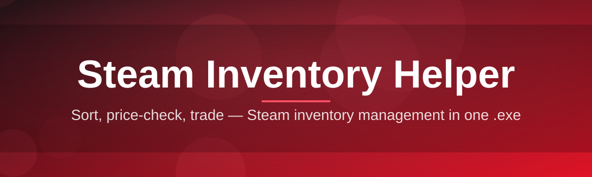
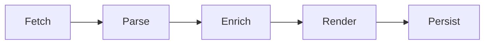

# inventory-manager-companion 🎒✨

  

*A calm, clear window into your Steam inventory — sort, value, and understand your items without the clutter.*

  

---

## 🧭 Overview

`inventory-manager-companion` is a lightweight desktop companion built for people who own more Steam items than they can reasonably track in their head. Trading cards, cosmetic drops, badges, gift copies, market listings — a modern Steam inventory grows quietly until it becomes a small archive. This tool exists to make that archive legible: a fast, local Steam inventory helper that organizes what you own, estimates what it might be worth, and surfaces patterns you'd otherwise scroll past.

The project was built with a simple premise: inventory management should feel like using a well-organized spreadsheet, not like reverse-engineering your own collection. Rather than replacing the Steam client, it sits alongside it — reading inventory data, presenting it clearly, and getting out of your way. It does not touch trades, does not automate market actions, and does not require a Steam login or API key to browse a public inventory snapshot.

It's aimed at collectors who like knowing what they have, traders who want a calmer view before they commit to a swap, and casual players who just opened their inventory one day and thought *"what is all of this?"* If that sounds familiar, you're the audience this was written for.

---

## 🧩 What It Actually Does

> [!NOTE]
> Every capability below runs locally against inventory data you load — nothing is uploaded, shared, or synced to a third-party server.

| Capability | What It Means In Practice |
|---|---|
| **Inventory Snapshotting** | Pulls a point-in-time view of your Steam inventory so you can browse it offline, without waiting on Steam's own pages to load. |
| **Smart Category Sorting** | Automatically groups items by type — trading cards, emoticons, backgrounds, tools, cosmetics — so similar things sit together. |
| **Value Estimation Layer** | Cross-references item data to give you a rough worth-at-a-glance figure, useful for quick sanity checks, not financial advice. |
| **Duplicate Detection** | Flags stacks of identical items (hello, extra card sets) so you know what's redundant before you decide what to do with it. |
| **Searchable Item Index** | A fast filter bar that narrows thousands of items down to the handful you're actually looking for. |
| **Custom Tagging** | Mark items as "keep," "watch," or anything else you invent — tags are yours, stored locally, and fully editable. |
| **Export Snapshots** | Save your current inventory view as a file you can compare against later, useful for tracking growth over time. |
| **Theme-Aware Interface** | Light and dark themes that match how long you're actually staring at the screen. |

 

> [!TIP]
> If you manage inventories across multiple Steam accounts, keep separate exported snapshots for each — the app can load whichever one you point it at.

---

## 🚀 How to Get Started

1. **Visit the landing page** using the download button above or below — this is the only place the current build lives.

2. **Download the installer** for Windows. No account creation, no email required.

3. **Run the executable.** Windows may show a SmartScreen prompt for new tools — this is standard for independently published software, not an error.

4. **Load your inventory snapshot** on first launch and let the companion do its sorting.

> [!IMPORTANT]
> Always download `inventory-manager-companion` from the official landing page linked in this README. Files from unrelated sites are not verified by this project.

---

## 🖥️ System Requirements

| Requirement | Details |
|---|---|
| **OS** | Windows 10 or Windows 11 (64-bit) |
| **Dependencies** | None — fully standalone, no runtime installs needed |
| **Disk Space** | Under 200 MB |
| **Network** | Optional — only needed for loading a fresh inventory snapshot |
| **Steam Client** | Not required to run; useful only if you want to open items directly |

  

---

## ⚙️ How It Works

The companion follows a short, predictable pipeline every time it opens an inventory:

1. **Fetch** — retrieve a public inventory snapshot for the given Steam profile.
2. **Parse** — break the raw data into structured item records.
3. **Enrich** — attach category labels, tags, and estimated values.
4. **Render** — display everything in a sortable, searchable grid.
5. **Persist** — save your tags and exports locally for next time.

---

## 🔧 Troubleshooting

<strong>The inventory won't load — what's wrong?</strong>

 
Check that the Steam profile's inventory privacy is set to public. Private inventories can't be read by any external inventory helper, by design.

<strong>Value estimates look off compared to the Steam Community Market.</strong>

 
Estimates are approximate and refresh on a delay. Treat them as a directional signal, not a live price feed.

<strong>Windows SmartScreen is blocking the app.</strong>

 
This is expected for smaller independent tools without a large-scale code-signing history. Choose "More info" then "Run anyway" if you trust the source — which should always be the official landing page.

<strong>My tags disappeared after an update.</strong>

 
Tags are stored in a local data file. If you moved or reinstalled the app to a new folder, point it back at the original data directory to recover them.

<strong>Can this trade or list items for me automatically?</strong>

 
No. The companion is read-and-organize only — it deliberately avoids automating any trade or market action.

<strong>Duplicate detection is flagging items I know aren't duplicates.</strong>

 
Some cosmetic variants share near-identical names. Hover over a flagged item to see its full internal ID for confirmation.

---

## 🎨 UI / UX Details

| Feature | Shortcut / Setting |
|---|---|
| **Quick Search** | `Ctrl + F` |
| **Toggle Theme** | `Ctrl + T` |
| **Refresh Snapshot** | `F5` |
| **Export Current View** | `Ctrl + E` |
| **Toggle Tag Panel** | `Ctrl + G` |

> [!TIP]
> Settings are stored per-profile, so switching between multiple Steam accounts won't mix up your tags or theme preferences.

- Light and dark themes, both tuned for long sorting sessions
- Adjustable grid density — compact, comfortable, or spacious item cards
- Persistent window size and last-used filters between sessions

---

## 🤝 Contributing & Community

Contributions, bug reports, and feature ideas are welcome. Before opening a pull request:

- Search existing issues to avoid duplicates
- Describe the *why* behind a change, not just the *what*
- Keep changes focused — smaller pull requests move faster

> [!WARNING]
> Please don't submit changes that add trade automation, market automation, or anything that interacts with Steam's servers beyond reading public inventory data. It's outside the project's scope by design.

---

## 📄 License

Released under the [MIT License](LICENSE), 2026.

---

## ⚠️ Disclaimer

`inventory-manager-companion` is an independent, community-built tool and is not affiliated with, endorsed by, or produced in association with Valve Corporation or Steam. All trademarks belong to their respective owners. Use this Steam inventory helper at your own discretion, and always keep your account credentials private — this tool never asks for them.

---

